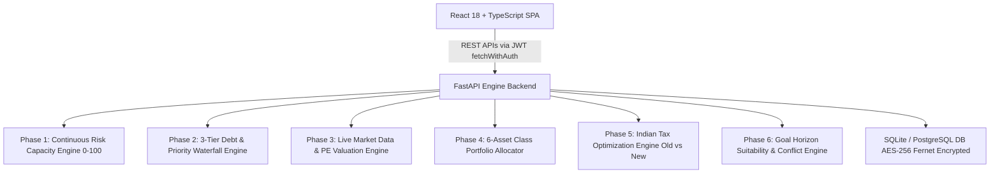

# 💎 Finverse — Autonomous Wealth Engineering & Financial Advisory Platform

> **An Enterprise-Grade, Full-Stack Personal Finance & Quantitative Wealth Management Platform Built Specifically for Indian Investors.**
> 
> *Combines continuous risk engineering, a 3-tier debt & cash-flow priority waterfall, 6-asset class portfolio optimization, live market regime detection, dynamic tax regime auditing (FY 2024–25 / FY 2025–26), goal conflict resolution, AES-256 Fernet data encryption, and Prof. Shelly AI—an empathetic, context-aware financial mascot.*


-009688?style=for-the-badge&logo=fastapi)


-brightgreen?style=for-the-badge)

---

## 📑 Table of Contents

1. [Executive Summary & Problem Statement](#-executive-summary--problem-statement)
2. [What Makes Finverse Unique? (USPs & Broker Comparison)](#-what-makes-finverse-unique-usps--broker-comparison)
3. [Flagship Advisory & Engineering Modules](#-flagship-advisory--engineering-modules)
   - [1. 3-Tier Strategic Priority Waterfall Engine](#1-3-tier-strategic-priority-waterfall-engine)
   - [2. 6-Asset Class Portfolio Allocator & Risk Engine](#2-6-asset-class-portfolio-allocator--risk-engine)
   - [3. Live Market Data Ingestion & PE Regime Engine](#3-live-market-data-ingestion--pe-regime-engine)
   - [4. Goal Horizon Suitability & Conflict Resolution Engine](#4-goal-horizon-suitability--conflict-resolution-engine)
   - [5. Indian Tax Optimization Advisor (Old vs New Regime)](#5-indian-tax-optimization-advisor-old-vs-new-regime)
   - [6. Credit Card Rewards Maximizer & CIBIL Nudges](#6-credit-card-rewards-maximizer--cibil-nudges)
   - [7. Periodic 30-Day Re-evaluation & Reminder System](#7-periodic-30-day-re-evaluation--reminder-system)
   - [8. Prof. Shelly AI Assistant (Architecture & Tuning)](#8-prof-shelly-ai-assistant-architecture--tuning)
4. [Mathematical Formulas & Quantitative Models](#-mathematical-formulas--quantitative-models)
5. [AI Beyond Chatbot](#-ai-beyond-chatbot)
6. [Security, Encryption & Privacy Architecture](#-security-encryption--privacy-architecture)
7. [Tech Stack Breakdown & Architectural Rationale](#-tech-stack-breakdown--architectural-rationale)
8. [Infrastructure, Hosting & Deployment (Vercel + Render)](#-infrastructure-hosting--deployment-vercel--render)
9. [Engineering Challenges & Technical Solutions](#-engineering-challenges--technical-solutions)
10. [Local Development & Testing Setup](#-local-development--testing-setup)

---

## 📌 Executive Summary & Problem Statement

### What is Finverse?
**Finverse** is a full-stack, autonomous wealth engineering and financial advisory platform tailored specifically to the Indian economic ecosystem. Unlike transaction-focused stock broking apps that merely provide a digital storefront for buying mutual funds or stocks, Finverse acts as an **algorithmic Chartered Accountant & Wealth Engineer**. It analyzes a user's entire cash flow, debt burden, risk capacity, tax liabilities, and future life goals to generate a single, mathematically optimal, step-by-step action plan.

### What Problem Are We Solving?
1. **The Debt-Before-Investment Paradox**: Millions of Indian retail investors start ₹5,000/month Equity SIPs while simultaneously carrying credit card debt at 42% APR or personal loans at 18% APR. Mathematically, investing at ~12% expected returns while paying 42% interest results in a net wealth destruction rate of 30% per year! Mainstream apps ignore existing debt because they do not earn commissions on debt payoff.
2. **One-Size-Fits-All Risk Profiling**: Traditional platforms use subjective 3-question surveys ("Are you aggressive?") to recommend portfolios. Finverse calculates a **Continuous Risk Capacity Score (0–100)** incorporating age, income stability, debt-to-income (DTI) ratios, emergency buffer coverage, dependent counts, and credit card utilization stress.
3. **Tax Misalignment**: Many investors blindly choose the New Tax Regime without auditing whether itemized deductions under Section 80C, 80D, 80CCD(1B), and Section 24b under the Old Regime would save them tens of thousands of Rupees.
4. **Market Peak FOMO / Lump-Sum Traps**: Retail investors frequently invest large lump sums into equity funds when market valuation multiples (Nifty 50 P/E > 24) are peak-priced. Finverse continuously monitors live market valuations to issue real-time lump-sum warnings and direct capital into short-duration debt until market pullbacks occur.

---

## ⚡ What Makes Finverse Unique? (USPs & Broker Comparison)

### Why Can't You Find This on Mainstream Platforms (Groww, Zerodha, Kuvera)?

| Feature / Capability | Mainstream Discount Brokers (e.g. Groww, Zerodha) | Finverse Autonomous Wealth Engineering |
| :--- | :--- | :--- |
| **Primary Revenue Model** | Order execution fees, demat charges, mutual fund distribution. | Conflict-free algorithmic advisory & wealth engineering. |
| **Debt Payoff Integration** | ❌ None. They ignore debt balances. | ✅ **Priority #1 Waterfall**: Forces toxic debt payoff (>18% APR) before allowing SIP capital allocation. |
| **Emergency Fund Shield** | ❌ Generic advice or absent. | ✅ **Dynamic 6× Expense Buffer**: Calculates exact ₹ target, splitting 50% Flexi-FD (Bank Sweep-In) + 50% Liquid Funds. |
| **Live Market PE Valuation** | ❌ Shows stock charts; no tactical lump-sum warnings. | ✅ **Live Nifty 50 P/E Regime Detection**: Automatically blocks equity lump-sums when P/E > 24.0. |
| **Goal Conflict Resolution** | ❌ Assumes infinite money; lets user set impossible goals. | ✅ **Mathematical Feasibility Engine**: Automatically recalculates timelines and delays goals if debt absorbs cash surplus. |
| **Tax Regime Audit Engine** | ❌ Basic calculator or external blog post. | ✅ **Algorithmic Tax Auditor**: Compares FY 2024–25 / FY 2025–26 Old vs New regimes with itemized savings down to the Rupee. |
| **Data Privacy & Encryption** | 🔒 Plaintext / Standard DB storage accessible to internal DBAs. | 🛡️ **AES-256 Fernet Application-Level Encryption**: Financial data is encrypted on disk before entering the DB. |

### Why Mainstream Platforms Will Never Build This:
Groww, Zerodha, and Angel One are **transaction platforms**. Their revenue is directly proportional to trading volume and asset under management (AUM). Telling a user *"Stop investing in mutual funds for 6 months and pay off your Credit Card bill first"* reduces their immediate AUM and revenue. Finverse is designed from the ground up as a **user-first wealth engineer**, prioritizing net-worth optimization over transaction commissions.

---

## 🛠️ Flagship Advisory & Engineering Modules



### 1. 3-Tier Strategic Priority Waterfall Engine (`backend/engine/priority.py`, `backend/engine/debt.py`)
Routes monthly net cash surplus ($\text{Surplus} = \text{Monthly Income} - \text{Monthly Expenses}$) through a mathematically enforced financial sequence:
- **Step A — Non-negotiable Minimum Dues**: Allocates minimum monthly dues across all active debt accounts to protect payment history (35% of CIBIL score weight).
- **Step B — Toxic Debt Avalanche (>18% APR)**: Directs 100% of remaining surplus to clear high-interest debts (credit card balances, personal loan roll-overs) ordered strictly by highest APR first.
- **Step C — 6-Month Emergency Shield**: Once toxic debt is cleared, builds a 6× monthly expense buffer split between **50% Bank Flexi-FD (Sweep-in)** for instant 24/7 liquid access and **50% Liquid Mutual Funds**.
- **Step D — Manageable Debt vs. Wealth SIP Compounding**: Evaluates manageable low-APR loans (e.g., home loans at 8.5% APR) against projected portfolio return ($\sim 12\%$). If projected returns exceed loan APR, surplus is routed to long-term wealth compounding SIPs.

### 2. 6-Asset Class Portfolio Allocator & Risk Engine (`backend/engine/allocation.py`, `backend/engine/risk.py`)
Calculates a continuous risk capacity score (0–100) and constructs 3 non-stagnant, age-adjusted portfolio comparison lenses (**Safe**, **Medium**, **Risky**) across 6 real-world Indian asset classes:
1. **Nifty 50 Large Cap Index Funds** ($\sim 12.0\%$ expected CAGR)
2. **Flexi Cap & Mid Cap Equity** ($\sim 13.5\%$ expected CAGR)
3. **Small Cap Index Funds** ($\sim 15.0\%$ expected CAGR)
4. **Fixed Deposits & Liquid Mutual Funds** ($\sim 6.5\%$ expected CAGR)
5. **Short Duration Corporate Debt & G-Secs** ($\sim 6.85\%$ yield tied to India 10Y Bond)
6. **Sovereign Gold Bonds (SGB) & Gold ETFs** ($\sim 8.0\%$ CAGR + 2.5% annual interest)

### 3. Live Market Data Ingestion & PE Regime Engine (`backend/engine/market_data.py`)
- **Real-Time Data Ingestion**: Uses `yfinance` to fetch live tickers (`^NSEI`, `^BSESN`, `GOLDBEES.NS`).
- **15-Minute In-Memory Cache**: Implements an in-memory cache TTL (`CACHE_TTL_SECONDS = 900.0`) with floating-point sanitizers to prevent redundant external API calls, rate-limiting, or page slowdowns.
- **Dynamic Market Valuation Regimes**:
  - **High Valuation ($P/E \ge 24.0$)**: Triggers `AVOID_LUMPSUM` caution badges, advising users to avoid equity lump sums and tilt surplus toward short-duration debt while maintaining systematic monthly SIPs.
  - **Undervalued ($P/E \le 18.5$)**: Triggers `STRONG_LUMPSUM_BUY` badges, encouraging lump-sum deployment into Large Cap and Flexi Cap index funds.
  - **Fair Valuation ($18.5 < P/E < 24.0$)**: Recommends balanced SIP execution.
- **Zero-Downtime Offline Fallback**: If offline or internet is restricted, the engine automatically switches to a structured market snapshot (`DEFAULT_MARKET_SNAPSHOT`), preventing backend exceptions.

### 4. Goal Horizon Suitability & Conflict Resolution Engine (`backend/engine/goal_conflicts.py`)
- **Horizon-Appropriate Asset Allocation**:
  - **Short-Term (< 3 Years)**: Recommends **100% Capital-Guaranteed Liquid Debt / Flexi-FD** (avoids equity crash volatility).
  - **Medium-Term (3–5 Years)**: Recommends **Balanced Advantage Hybrid Funds (60/40) + Gold**.
  - **Long-Term (> 5 Years)**: Recommends **Nifty 50 Index Funds + Flexi-Cap Equity SIP**.
- **Conflict & Delay Calculator**: If debt payoff or emergency fund deficits absorb monthly cash flow, required goal contributions are recalculated. Rather than making false promises, the engine transparently calculates exact delay timelines (e.g., *"Target date delayed by 8 months due to Priority #1 Credit Card Payoff"*).

### 5. Indian Tax Optimization Advisor (`backend/engine/tax_engine.py`)
- **Old vs. New Tax Regime Audit**: Side-by-side comparative analysis under FY 2024–25 and FY 2025–26 budget slabs.
- **Itemized Deductions**: Evaluates Section **80C** (ELSS, EPF, PPF up to ₹1.5L), **80D** (Health Insurance up to ₹75k), **80CCD(1B)** (NPS ₹50k), **Section 24b** (Home Loan Interest up to ₹2L), Standard Deduction (₹75k New / ₹50k Old), and Section **87A** rebate.
- **Winner Regime Highlight**: Identifies the tax-winning regime and outputs itemized annual Rupee savings.

### 6. Credit Card Rewards Maximizer & CIBIL Nudges (`backend/engine/debt.py`, `backend/engine/rewards.py`)
- **Utilization Stress Detection**: Flags credit cards operating above 30% limit utilization, deducting risk points and issuing utilization warnings.
- **CIBIL Score Nudges**: Provides guidance for zero-credit history users (recommending FD-backed secured cards) and high-utilization users (warning against hard credit inquiries).
- **Rewards Maximizer**: Evaluates category spend multipliers (Fuel, Dining, Travel, Online Shopping) across top Indian cards (SBI Cashback, HDFC Regalia Gold, Axis Atlas, IDFC FIRST Wow).

### 7. Periodic 30-Day Re-evaluation & Reminder System (`frontend/src/dashboard/DashboardPage.tsx`, `MonthlyCheckinModal.tsx`)
- **Automated Monthly Check-In**: The platform tracks user activity timestamps (`last_checkin_timestamp_${user.id}`). When a user logs in after 30 days ($\Delta t \ge 30\text{ days}$), the `MonthlyCheckinModal` automatically pops up.
- **Dynamic Re-calibration**:
  - **Payment Executed**: Deducts debt principal and updates waterfall completion percentages.
  - **Payment Missed**: Calculates 1 month of accrued interest ($\text{Balance} + (\text{Balance} \times \frac{\text{APR}}{1200})$), updates the loan balance, and re-evaluates the user's priority roadmap.

### 8. Prof. Shelly AI Assistant (Architecture & Tuning) (`backend/engine/shelly_gemini.py`)
- **Persona & Mascot**: Prof. Shelly 🐢 is a sharp, witty, caring mascot delivering concise financial guidance.
- **Gemini Model Integration**: Uses `gemini-2.0-flash` (with fallback to `gemini-1.5-flash` / REST API endpoints).
- **API Parameters & Tuning**:
  - **Temperature**: Set to `0.5` to ensure structured financial accuracy while maintaining engaging, human conversational tone.
  - **Max Tokens**: Capped at `800` tokens to prevent verbose text wall answers.
  - **Context Grounding**: Injects real-time user state (Age, Monthly Surplus, Risk Tier, Toxic Debt Balance) and Live Market P/E status into the prompt.
  - **Structured Action Output**: Appends executable UI navigation blocks (`json_actions`) allowing users to click action buttons inside the chat to navigate directly to `/portfolios`, `/debt`, or `/tax`.
  - **Local Engine Fallback**: If `GEMINI_API_KEY` is not provided or network is unreachable, Shelly smoothly falls back to a deterministic rule-based local financial response engine.

---

## 📐 Mathematical Formulas & Quantitative Models

### 1. Continuous Risk Capacity Score (0–100)
$$\text{Risk Score} = \text{Clamp}\Big(0, \, 100, \, \text{AgeScore} + \text{IncomeScore} + \text{SavingsScore} + \text{DebtScore} + \text{Modifiers}\Big)$$

Where:
- **Age Factor**:
  $$\text{AgeScore} = \max\left(0, \, \frac{65 - \text{Age}}{45}\right) \times 25$$
- **Income Capacity Factor**:
  $$\text{IncomeScore} = \min\left(1.0, \, \frac{\text{Annual Income}}{3,000,000}\right) \times 25$$
- **Savings Buffer Factor**:
  $$\text{SavingsScore} = \min\left(1.0, \, \frac{\text{Current Savings}}{6 \times \text{Monthly Expenses}}\right) \times 25$$
- **Debt-to-Income (DTI) Factor**:
  $$\text{DebtScore} = \max\left(0.0, \, 1.0 - \frac{\text{Total Debt}}{\text{Annual Income} \times 2}\right) \times 25$$
- **Stress Modifiers**:
  - Employment Modifier: $+5$ (Govt/PSU), $0$ (Private Salaried), $-10$ (Self-Employed), $-15$ (Unemployed/Freelance).
  - Dependents Modifier: $-3.0 \times \text{Dependents Count}$ (capped at $-15$).
  - Credit Utilization Stress Penalty: Capped up to $-15.0$ if card utilization $> 30\%$.

### 2. Baseline Equity Percentage Rule
$$\text{Base Equity \%} = \text{Clamp}\left(15\%, \, 85\%, \, (110 - \text{User Age}) + \frac{\text{Risk Score} - 50}{50} \times 15\%\right)$$

### 3. Debt Amortization Payoff Months Formula
$$\text{Payoff Months } n = -\frac{\ln\left(1 - \frac{r \cdot B}{P}\right)}{\ln(1 + r)}$$
Where $B = \text{Current Debt Balance}$, $r = \frac{\text{APR}}{12 \times 100}$ (Monthly Interest Rate), and $P = \text{Monthly Payment Allocated}$.

---

## 🧠 AI Beyond Chatbot

While many apps limit AI to a basic Q&A chat box, Finverse embeds algorithmic intelligence throughout the core system:
1. **Dynamic Risk Capacity Engine**: Programmatically evaluates multi-variable inputs (demographics, liquidity stress, DTI) to calculate risk capacity rather than relying on static surveys.
2. **Market Regime Detection**: Translates live financial feeds into actionable investment advice, protecting users from peak market lump-sum traps.
3. **Automated Tax Audit & Winner Selection**: Dynamically calculates Old vs New regime scenarios to determine the optimal tax strategy.
4. **Goal Feasibility & Timeline Recalibration**: Uses predictive amortization to dynamically adjust goal completion dates based on available surplus.

---

## 🔒 Security, Encryption & Privacy Architecture

```
[ User Financial Input ] ──> [ FastAPI Application Layer ] ──> [ Fernet AES-256 Symmetric Encryption ] ──> [ DB Storage ]
```

1. **Application-Level Symmetric Field Encryption (`backend/db/encryption.py`)**:
   - Financial figures (`encrypted_salary`, `encrypted_expenses`, `encrypted_savings`, `encrypted_balance`, `encrypted_target_amount`) are encrypted in Python before being written to the database.
   - Encryption standard: **AES-256 Fernet (CBC mode with PKCS7 padding and HMAC-SHA256 authentication)** derived via **PBKDF2HMAC** with 100,000 iterations.
   - **Zero Raw Data Exposure**: Even if an attacker or database administrator gains direct access to the SQLite/PostgreSQL database file, all financial numbers appear as unreadable encrypted ciphertexts.
2. **Password Security (`backend/auth/security.py`)**:
   - Passwords are salted and hashed using **PBKDF2-SHA256 / Bcrypt**. Plaintext passwords are never logged or stored.
3. **Session Authentication & Protection**:
   - Uses **JSON Web Tokens (JWT)** with `HS256` signing and a **24-hour max session validity** window.
   - Enforces an automated **30-minute idle inactivity auto-logout** to prevent unauthorized access on shared or mobile devices.

---

## 🏗️ Tech Stack Breakdown & Architectural Rationale

### Frontend Framework
- **React 18 + TypeScript**: Provides a type-safe single-page application (SPA) architecture.
- **Vite**: Ultra-fast build tool and local development server.
- **Tailwind CSS + Vanilla CSS Tokens**: Clean design system following function-driven guidelines (avoiding clichés like colored glow borders or heavy dark purple gradients).
- **Recharts**: Responsive SVG charts for visualizing investment compounding trajectories and asset breakdowns.
- **Lucide React Icons**: Consistent UI iconography.

### Backend Engine
- **Python 3.10+ & FastAPI**: Asynchronous REST API framework offering high throughput, type safety, and automatic OpenAPI validation docs (`/docs`).
- **SQLAlchemy 2.0 ORM**: Type-annotated declarative ORM handling relational mappings across users, profiles, debts, credit cards, and goals.
- **Pytest (42 Automated Tests)**: Complete test coverage validating risk scores, priority waterfalls, tax logic, debt amortization, and market data fallbacks.

---

## 🌐 Infrastructure, Hosting & Deployment (Vercel + Render)

```
                       ┌─────────────────────────┐
                       │  Vercel Edge CDN        │
                       │  (Frontend React SPA)   │
                       └────────────┬────────────┘
                                    │ REST API (JSON + JWT)
                                    ▼
                       ┌─────────────────────────┐
                       │  Render Web Service     │
                       │  (FastAPI Backend)      │
                       └────────────┬────────────┘
                                    │ Encrypted SQL
                                    ▼
                       ┌─────────────────────────┐
                       │  SQLite / PostgreSQL    │
                       │  (AES-256 Fernet DB)    │
                       └─────────────────────────┘
```

### 1. Frontend Hosting — Vercel
- **Single Page Application Routing**: Configured via `frontend/vercel.json` to route all SPA traffic to `index.html`.
- **Global Edge Network**: Serves static assets with minimal latency.

### 2. Backend Deployment — Render
- **Python Web Service**: Configured via `render.yaml` using `Dockerfile` or `uvicorn backend.api.main:app --host 0.0.0.0 --port 10000`.
- **Environment Management**: Stores secrets (`APP_ENCRYPTION_KEY`, `JWT_SECRET`, `GEMINI_API_KEY`) securely in Render environment variables.

---

## 🥊 Engineering Challenges & Technical Solutions

| Problem Faced | Root Cause | Technical Solution Applied |
| :--- | :--- | :--- |
| **API Latency & Rate Limits** | External financial data APIs can be slow or impose strict rate limits. | Implemented an **in-memory 15-minute TTL cache** with floating-point sanitization and an **offline snapshot fallback** (`DEFAULT_MARKET_SNAPSHOT`). |
| **LLM Verbosity & Hallucinations** | Default LLMs tend to return long paragraphs or invalid suggestions. | Enforced strict system instructions (`SHELLY_SYSTEM_INSTRUCTION`), capped tokens at 800, and integrated structured JSON action blocks (`json_actions`). |
| **Database Privacy & Inspection** | Plaintext financial numbers in DB tables present privacy risks. | Developed custom application-level **AES-256 Fernet encryption decorators** in SQLAlchemy model hooks (`encryption.py`). |
| **Goal Timeline Irrealism** | Users often set ambitious goals that exceed their actual surplus. | Built the **Goal Conflict Engine** (`goal_conflicts.py`), which recalculates feasible timelines based on net available surplus after debt payments. |

---

## 🚀 Local Development & Testing Setup

### Prerequisites
- **Node.js**: `v18.0+`
- **Python**: `v3.10+`

### 1. Repository Setup
```bash
git clone https://github.com/uttammuthanna68/Finverse.git
cd Finverse
```

### 2. Backend Setup
```bash
# Create Python Virtual Environment
python -m venv venv

# Activate Virtual Environment
# Windows:
venv\Scripts\activate
# macOS/Linux:
source venv/bin/activate

# Install Dependencies
pip install -r backend/requirements.txt

# Run FastAPI Server
python -m uvicorn backend.api.main:app --host 127.0.0.1 --port 8000 --reload
```
API Documentation will be accessible at: `http://127.0.0.1:8000/docs`

### 3. Frontend Setup
```bash
cd frontend
npm install
npm run dev
```
The Frontend Web Application will run at: `http://localhost:5173`

### 4. Running Automated Unit Tests
```bash
# In project root with active venv
python -m pytest backend
```
Executes all **42 automated unit tests** covering risk calculation, priority waterfall, debt amortization, tax optimization, and asset allocation modules.

---

## 👤 Author & Portfolio Information

- **Developer**: **Uttam Muthanna**
- **GitHub Repository**: [@uttammuthanna68/Finverse](https://github.com/uttammuthanna68/Finverse)
- **Project**: Finverse — Autonomous Wealth Engineering & Advisory Platform
